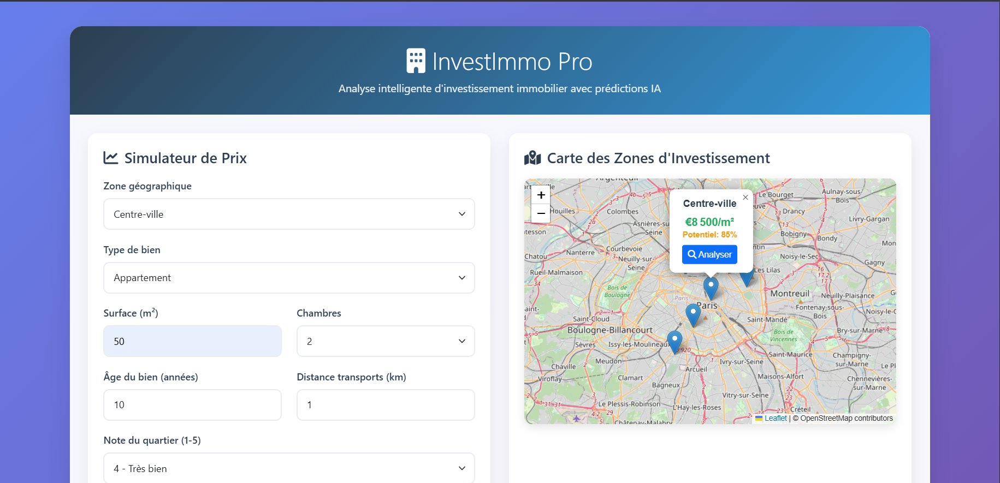
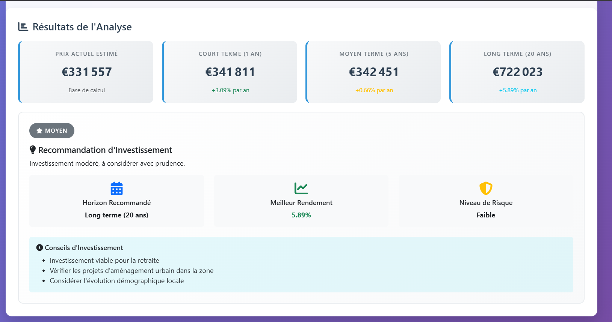
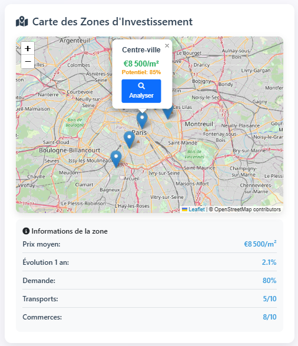

#  InvestImmo Pro - Guide Complet

InvestImmo Pro est une application web intelligente pour l'analyse d'investissements immobiliers. Elle utilise des modèles de machine learning (scikit-learn) pour prédire l'évolution des prix immobiliers à court, moyen et long terme.
## 🚀 Features

- Prédictions de prix : Court terme (1 an), moyen terme (5 ans), long terme (20 ans)
- Carte interactive : Visualisation des zones d'investissement avec Leaflet
- Analyse de zones : Évaluation détaillée des quartiers
- Recommandations : Conseils personnalisés basés sur l'IA
- Interface responsive : Compatible mobile et desktop

## 📷 Screenshot





## 🛠️ Installation

```bash
git clone https://github.com/TarikEloukili/Projet-d-Investissement-Immobilier-Interactif.git
python -m venv venv
source venv/bin/activate  # Sur Windows: venv\Scripts\activate
pip install -r requirements.txt
python app.py
```

L'application sera accessible sur : http://127.0.0.1:5000
